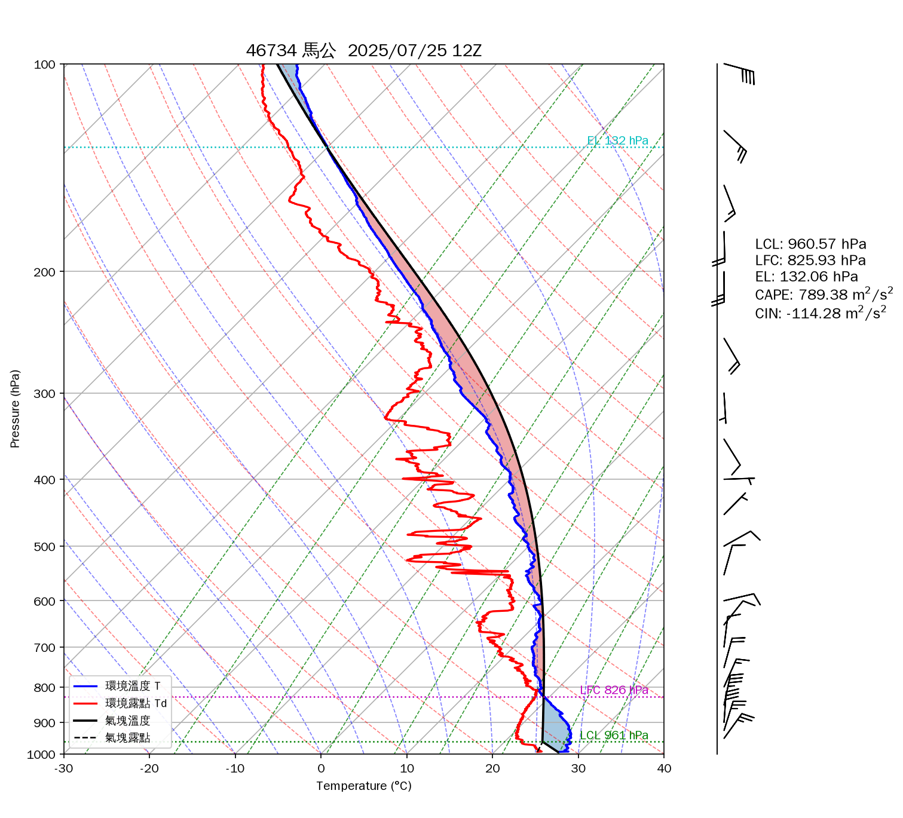

# 天氣學 HW1 — 探空圖（46734 馬公，2025/07/25 12Z）

## 結果（氣塊由地面抬升）

| 項目 | 數值 |
|---|---|
| 地面 | 993.7 hPa、34 m、T = 27.4 °C、Td = 25.0 °C（RH 86.8%） |
| **LCL** | **960.57 hPa**（約 337 m，T ≈ 24.4 °C） |
| **LFC** | **825.93 hPa**（約 1664 m） |
| **EL**  | **132.06 hPa**（約 15168 m） |
| **CAPE** | **789.38 m²/s²**（J/kg） |
| **CIN**  | **−114.28 m²/s²**（J/kg） |

## 檔案

- `hw1_skewt.py`：主程式（上傳 NTU COOL 用）
- `46734-2025072512.csv`：探空資料（高度、P、T、RH、WS、WD，共 3378 筆 1 秒資料）
- `skewt_46734_2025072512.png`：程式畫出的斜溫圖
- `results.txt`：程式的輸出

執行方式：`python hw1_skewt.py`；也可以直接讀原始檔：`python hw1_skewt.py 46734-2025072512.edt.txt`。

## 方法（依課程投影片的程式指引）

1. 露點：Td 由 `e = RH·es(T)` 代入 `es = 611.2 exp(17.67T/(T+243.5))` 的反函數求得。
2. 氣塊抬升：用相鄰兩筆資料的 Δz 逐層往上算。
   - 未飽和：`T[k+1] = T[k] − Γd·Δz`，其中 `Γd = g/Cp`。混合比 rv 維持地面值，每一層都計算 `es` 和 `rvs`，得出 `RH = rv/rvs`。
   - RH ≥ 100% 的地方就是 **LCL**（在前後兩層間內插）。之後改用濕絕熱：
     `Γm = g(1 + Lv·rvs/(Rd·T)) / (Cp + Lv²·rvs·ε/(Rd·T²))`
3. **LFC**：LCL 以上，氣塊溫度第一次由低於環境變成高於環境的高度。**EL**：氣塊最後一次由暖轉冷的高度。
4. **CAPE** = ∫(LFC→EL) g(Tpar − Tenv)/Tenv dz；**CIN** = ∫(地面→LFC) g(Tpar − Tenv)/Tenv dz。兩者都用梯形法積分。
   （投影片上 CIN 的積分上下限寫成 EL、LFC，應是筆誤。依定義，CIN 是地面到 LFC 的負浮力區，這裡照定義計算。）

### 驗證
MetPy 的 `lcl()` 算出 LCL = 958.99 hPa，和本程式一致。MetPy 的 `cape_cin()` 得 CAPE ≈ 965、CIN ≈ −90 J/kg。差異來自 MetPy 的濕絕熱線和課程給的 Γm 公式不同。作業要求使用課程公式，所以以本程式的數值為準。

## 紙本作業用：標準層資料

| P (hPa) | 高度 (m) | T (°C) | Td (°C) | 氣塊 T (°C) | 風向 (°) | 風速 (m/s) | 風速 (kt) |
|---|---|---|---|---|---|---|---|
| 1000 | 低於地面 | — | — | — | — | — | — |
| 地面 993.7 | 34 | 27.4 | 25.0 | 27.4 | 50 | 2.5 | 4.9 |
| 925 | 672 | 26.3 | 20.2 | 23.1 | 17 | 14.1 | 27.4 |
| 850 | 1415 | 21.2 | 18.5 | 20.3 | 12 | 17.0 | 33.1 |
| 700 | 3073 | 12.1 | 8.3 | 13.5 | 7 | 5.3 | 10.3 |
| 500 | 5839 | −0.1 | −6.8 | 0.9 | 61 | 4.6 | 8.9 |
| 400 | 7592 | −10.0 | −21.8 | −8.4 | 88 | 3.1 | 6.1 |
| 300 | 9748 | −25.7 | −31.7 | −22.3 | 177 | 2.7 | 5.2 |
| 250 | 11047 | −34.8 | −37.2 | −32.2 | 149 | 11.4 | 22.2 |
| 200 | 12565 | −47.0 | −50.6 | −45.4 | 180 | 14.1 | 27.4 |
| 150 | 14399 | −63.1 | −69.2 | −62.7 | 159 | 8.9 | 17.3 |
| 100 | 16763 | −83.1 | −87.1 | −85.6 | 105 | 19.7 | 38.3 |

- 1000 hPa 在地面（993.7 hPa）以下，沒有觀測資料。風標可以改畫地面風，或標註「地面以下」。
- 風標畫法：竿子指向風的來向。半羽 = 5 kt，全羽 = 10 kt，三角旗 = 50 kt，四捨五入到 5 kt。
  例如 850 hPa 是 12°、33 kt，就是從北北東吹來，畫 3 全羽 + 1 半羽（35 kt）。
- 手繪氣塊線：從地面 27.4 °C 沿乾絕熱線往上；同時從 Td = 25.0 °C 沿等混合比線往上。兩線交在約 961 hPa（LCL），之後改沿濕絕熱線往上。
